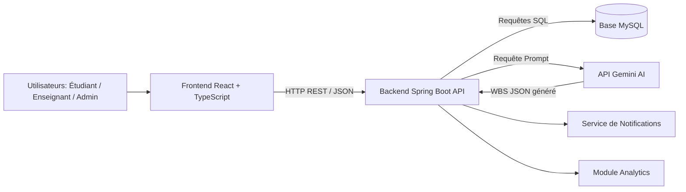

Claude a terminé la réponse.

Voici un README.md professionnel et complet pour ton repo Smart DevCollab. Tu peux le copier directement dans ton fichier README.md. # Smart DevCollab Smart DevCollab is a collaborative web platform designed to help academic teams manage projects, tasks, communication, notifications and AI-assiste

pasted

give the full read me for this project i already have a version jst translate it to french :and remove the git commands and the note of never putting the api key in the code

21:29

Consulté un fichier, fichier créé, lu un fichier
Consulté un fichier, fichier créé, lu un fichier
Voilà le README complet traduit en français. Ce qui a été fait :

Traduction intégrale de tout le contenu en français, y compris les titres, descriptions, tableaux et commentaires de code
Commandes git supprimées (la section entière "Git Commands" a été retirée)
Note sur la clé API supprimée (la section "Important Security Note" a été retirée)
La section workflow Git avec la répartition des branches et responsabilités de chaque membre a été conservée, car elle reste utile pour comprendre l'organisation du projet

Readme
Document · MD 


Souhaitez-vous être averti lorsque Claude répond ?


Claude est une IA et peut faire des erreurs. Veuillez vérifier les réponses.


raw
Readme · MD
# Smart DevCollab
 
Smart DevCollab est une plateforme web collaborative conçue pour aider les équipes académiques à gérer leurs projets, tâches, communications, notifications et la planification assistée par IA.
 
La plateforme permet aux utilisateurs de créer des projets, gérer les membres d'équipe, organiser les tâches via un tableau Kanban, communiquer au sein du projet, recevoir des notifications, analyser la progression et générer automatiquement un plan WBS grâce à un assistant IA.
 
---
 
## Contexte du Projet
 
Ce projet a été développé dans le cadre d'un projet académique de fin d'études.
 
### Membres de l'équipe
 
- Aya Agrigah
- Atiqa Essayouti
- Mustapha Aarab
### Sujet du Projet
 
Smart DevCollab est une plateforme de gestion de projets collaboratifs avec un assistant IA intégré pour la génération automatique de WBS et l'assignation intelligente des tâches.
 
---
 
## Fonctionnalités Principales
 
- Authentification sécurisée avec JWT
- Inscription et connexion des utilisateurs
- Contrôle d'accès basé sur les rôles : Étudiant, Enseignant, Administrateur
- Création, modification et suppression de projets
- Gestion des membres de projet
- Création et assignation de tâches
- Tableau Kanban avec suivi du statut des tâches
- Priorités et délais des tâches
- Chat d'équipe avec partage de fichiers PDF
- Notifications internes
- Suivi des activités
- Analyses et statistiques
- Assistant IA pour la génération de WBS
- Correspondance des compétences pour l'assignation des tâches
- Export PDF des résultats IA
---
 
## Technologies Utilisées
 
### Frontend
 
- React.js
- TypeScript
- Vite
- CSS
- Recharts
- Lucide React
### Backend
 
- Java
- Spring Boot
- Spring Security
- Spring Data JPA
- Authentification JWT
- API REST
### Base de Données
 
- MySQL
### Intelligence Artificielle
 
- API Gemini
- Génération de WBS par prompts
- Correspondance des compétences
- Suggestion automatique de tâches
---
 
## Architecture Globale
 

 
## Architecture Technique
 
```
Smart-DevCollab/
│
├── backend/
│   ├── pom.xml
│   └── src/main/
│       ├── java/ma/enset/smartdevcollab/
│       │   ├── config/
│       │   ├── controller/
│       │   ├── entity/
│       │   ├── repository/
│       │   ├── security/
│       │   └── service/
│       │
│       └── resources/
│           ├── application.properties
│           └── application-example.properties
│
├── frontend/
│   ├── package.json
│   ├── index.html
│   └── src/
│       ├── api/
│       │   └── client.ts
│       ├── pages/
│       │   ├── Login.tsx
│       │   ├── Register.tsx
│       │   ├── Dashboard.tsx
│       │   ├── Projects.tsx
│       │   ├── Kanban.tsx
│       │   ├── AiPlanner.tsx
│       │   ├── Analytics.tsx
│       │   ├── Notifications.tsx
│       │   └── TeamChat.tsx
│       ├── App.tsx
│       ├── main.tsx
│       └── styles.css
│
├── docs/
│   ├── architecture-technique.png
│   ├── diagramme-classes.png
│   ├── diagramme-sequence.png
│   ├── diagramme-use-case.png
│   └── diagramme-gantt.png
│
├── README.md
└── .gitignore
```
 
## Architecture Backend
 
Le backend suit une architecture en couches :
 
```
Couche Controller
    ↓
Couche Service
    ↓
Couche Repository
    ↓
Base de données MySQL
```
 
### Packages Principaux du Backend
 
| Package | Rôle |
|---|---|
| controller | Expose les endpoints de l'API REST |
| service | Contient la logique métier |
| repository | Gère l'accès à la base de données via Spring Data JPA |
| entity | Contient les entités JPA |
| security | Gère le JWT et l'authentification |
| config | Contient la configuration Spring Security |
 
---
 
## Architecture Frontend
 
Le frontend est construit avec React et TypeScript.
 
### Pages Principales
 
| Page | Description |
|---|---|
| Login.tsx | Authentification utilisateur |
| Register.tsx | Inscription utilisateur |
| Dashboard.tsx | Vue d'ensemble globale des projets |
| Projects.tsx | Gestion des projets |
| Kanban.tsx | Gestion des tâches et tableau Kanban |
| AiPlanner.tsx | Génération de WBS par IA |
| Analytics.tsx | Statistiques et graphiques |
| Notifications.tsx | Notifications utilisateur |
| TeamChat.tsx | Communication d'équipe et partage PDF |
 
### Communication API
 
Tous les appels API du frontend sont centralisés dans :
 
```
frontend/src/api/client.ts
```
 
Le frontend communique avec le backend via des appels REST API.
 
---
 
## Module IA
 
Le module IA permet aux utilisateurs de rédiger un prompt de projet. Gemini génère ensuite un plan WBS structuré.
 
### Exemple de Prompt
 
```
Génère un plan WBS pour une plateforme de gestion de bibliothèque universitaire.
 
Le projet doit inclure :
- inscription et connexion des étudiants
- recherche de livres par titre, auteur et catégorie
- réservation de livres
- gestion des prêts et des retours
- gestion administrative des livres
- notifications de retard
- tableau de bord avec statistiques
 
Membres de l'équipe :
Aya : React, TypeScript, UI, UX, Frontend
Atiqa : Spring Boot, REST API, MySQL, Backend
Mustapha : Spring Security, JWT, Tests, Documentation
 
Génère les tâches principales avec :
- titre de la tâche
- description courte
- membre responsable selon les compétences
- priorité FAIBLE, MOYENNE ou HAUTE
- livrable attendu
```
 
### Sortie IA
 
L'IA retourne une structure JSON similaire à :
 
```json
[
  {
    "title": "Conception de la base de données",
    "description": "Créer le schéma de la base MySQL",
    "assignee": "Atiqa",
    "priority": "HIGH",
    "deliverable": "MCD et script SQL"
  }
]
```
 
Les tâches générées peuvent ensuite être sauvegardées automatiquement dans le projet sélectionné.
 
---
 
## Installation
 
### Prérequis
 
Assurez-vous d'avoir installé :
 
- Java 17 ou supérieur
- Maven
- Node.js
- npm
- MySQL
- Git
### Configuration du Backend
 
Accédez au dossier backend :
 
```bash
cd backend
```
 
Créez ou mettez à jour :
 
```
src/main/resources/application.properties
```
 
Exemple de configuration :
 
```properties
spring.application.name=smart-devcollab
server.port=8080
 
spring.datasource.url=jdbc:mysql://localhost:3306/smart_devcollab?createDatabaseIfNotExist=true&useSSL=false&serverTimezone=UTC&allowPublicKeyRetrieval=true
spring.datasource.username=root
spring.datasource.password=
 
spring.jpa.hibernate.ddl-auto=update
spring.jpa.show-sql=true
spring.jpa.properties.hibernate.dialect=org.hibernate.dialect.MySQLDialect
 
app.jwt.secret=SmartDevCollabSecretKeyForAcademicProjectMustBeLongEnough123456
app.jwt.expiration=86400000
 
spring.servlet.multipart.max-file-size=20MB
spring.servlet.multipart.max-request-size=20MB
server.tomcat.max-swallow-size=20MB
 
gemini.api.key=VOTRE_CLE_API_GEMINI
gemini.model=gemini-2.5-flash
```
 
Démarrez le backend :
 
```bash
mvn clean spring-boot:run
```
 
URL du backend :
 
```
http://localhost:8080
```
 
### Configuration du Frontend
 
Accédez au dossier frontend :
 
```bash
cd frontend
```
 
Installez les dépendances :
 
```bash
npm install
```
 
Démarrez le frontend :
 
```bash
npm run dev
```
 
URL du frontend :
 
```
http://localhost:5173
```
 
---
 
## Endpoints API Principaux
 
### Authentification
 
| Méthode | Endpoint | Description |
|---|---|---|
| POST | /api/auth/register | Inscrire un nouvel utilisateur |
| POST | /api/auth/login | Se connecter et recevoir un JWT |
 
### Projets
 
| Méthode | Endpoint | Description |
|---|---|---|
| GET | /api/projects | Récupérer tous les projets accessibles |
| POST | /api/projects | Créer un projet |
| PUT | /api/projects/{id} | Mettre à jour un projet |
| DELETE | /api/projects/{id} | Supprimer un projet |
| GET | /api/projects/{id}/members | Récupérer les membres du projet |
| POST | /api/projects/{id}/members | Ajouter un membre au projet |
 
### Tâches
 
| Méthode | Endpoint | Description |
|---|---|---|
| GET | /api/tasks/project/{projectId} | Récupérer les tâches d'un projet |
| POST | /api/tasks | Créer une tâche |
| PUT | /api/tasks/{id} | Mettre à jour une tâche |
| DELETE | /api/tasks/{id} | Supprimer une tâche |
| PUT | /api/tasks/{id}/status | Mettre à jour le statut d'une tâche |
 
### IA
 
| Méthode | Endpoint | Description |
|---|---|---|
| POST | /api/ai/plan | Générer des tâches WBS via IA |
| POST | /api/ai/projects/{projectId}/tasks | Créer des tâches à partir du résultat IA |
 
### Notifications
 
| Méthode | Endpoint | Description |
|---|---|---|
| GET | /api/notifications | Récupérer les notifications utilisateur |
| PUT | /api/notifications/{id}/read | Marquer une notification comme lue |
 
### Chat
 
| Méthode | Endpoint | Description |
|---|---|---|
| GET | /api/messages/project/{projectId} | Récupérer les messages d'un projet |
| POST | /api/messages/project/{projectId} | Envoyer un message ou un PDF |
| GET | /api/messages/{messageId}/file | Télécharger une pièce jointe PDF |
 
### Analytics
 
| Méthode | Endpoint | Description |
|---|---|---|
| GET | /api/analytics | Récupérer les statistiques globales |
| GET | /api/analytics/project/{projectId} | Récupérer les statistiques d'un projet |
 
---
 
## Sécurité
 
L'application utilise l'authentification JWT.
 
Après connexion, le backend retourne un token. Le frontend le stocke et l'envoie dans les en-têtes de chaque requête :
 
```
Authorization: Bearer TOKEN
```
 
### Rôles
 
| Rôle | Description |
|---|---|
| STUDENT | Peut travailler sur les projets et tâches assignés |
| TEACHER | Peut accéder et superviser les projets |
| ADMIN | Peut gérer la plateforme globalement |
 
---
 
## Tables de la Base de Données
 
Les principales tables de la base de données sont :
 
- users
- projects
- tasks
- project_members
- notifications
- activity_logs
- project_messages
- skills
---
 
## Collaboration d'Équipe
 
La plateforme supporte la collaboration d'équipe via :
 
- l'assignation de tâches
- la gestion des membres de projet
- le fil d'activité
- les messages de chat
- le partage de PDF
- les notifications internes
- les alertes de délais
Lorsqu'une tâche est assignée à un membre, l'utilisateur reçoit une notification. Lorsqu'un message est envoyé dans le chat d'équipe, les autres membres reçoivent une notification.
 
---
 
## Calendrier du Projet
 
Le projet a été réalisé entre le **26 mai** et le **5 juin**.
 
Étapes principales :
 
1. Analyse des besoins
2. Conception fonctionnelle et technique
3. Développement de la base de données et du backend
4. Authentification et sécurité
5. Gestion des projets et des tâches
6. Implémentation du Kanban
7. Génération WBS par IA
8. Analytics et tableau de bord
9. Chat et notifications
10. Tests, documentation et présentation finale
---
 
## Workflow Git
 
Structure de branches recommandée :
 
```
main
├── aya-auth-dashboard
├── atiqa-projects-kanban-notifications
└── mustapha-ai-analytics-chat
```
 
### Aya
 
Responsable de :
 
- authentification
- login / register
- dashboard
- layout
- sécurité utilisateur
### Atiqa
 
Responsable de :
 
- projets
- tâches
- Kanban
- notifications
- membres de projet
### Mustapha
 
Responsable de :
 
- assistant IA
- analytics
- chat d'équipe
- journaux d'activité
- intégration Gemini
---
 
## Erreurs Fréquentes
 
### Gemini 503
 
```
This model is currently experiencing high demand.
```
 
Cela signifie que Gemini est temporairement surchargé. Réessayez plus tard ou utilisez un modèle plus léger :
 
```properties
gemini.model=gemini-2.0-flash
```
 
### Gemini 404
 
```
Model not found
```
 
Utilisez un modèle supporté :
 
```properties
gemini.model=gemini-2.5-flash
```
 
### OpenAI 429
 
```
insufficient_quota
```
 
Cela signifie que le compte API OpenAI n'a plus de quota disponible. Gemini peut être utilisé comme alternative.
 
### Backend refus de connexion
 
```
ERR_CONNECTION_REFUSED
```
 
Cela signifie que le backend Spring Boot ne tourne pas. Démarrez-le avec :
 
```bash
mvn spring-boot:run
```
 
---
 
## Améliorations Futures
 
- Notifications temps réel via WebSocket
- Kanban drag-and-drop avec mises à jour en direct
- Permissions de rôles avancées
- Délais générés par IA
- Rapports PDF générés par IA
- Calendrier d'équipe
- Notifications par e-mail
- Déploiement avec Docker
- Intégration base de données cloud
---
 
## Conclusion
 
Smart DevCollab combine gestion de projet, collaboration et intelligence artificielle en une seule plateforme. Elle aide les équipes académiques à organiser leur travail, assigner les tâches selon les compétences, suivre la progression via un tableau Kanban, communiquer efficacement et générer des plans de projet automatiquement grâce à l'IA.
 
Le projet démontre une architecture full-stack complète utilisant React, Spring Boot, MySQL, la sécurité JWT et l'IA Gemini.
 
